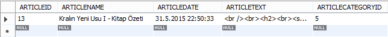
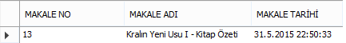
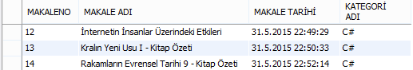

#Takma İsim(Alias) Tanımlama

Merhaba,

  Bugün SQL kodları yazarken bize kolaylık sağlayan takma isim ile ilgili bir şeyler yazmak istiyorum.
İngilizce karşılığı alias olan takma isimleri kullanmak kolay ve gerekli :).

  Uzun tablo ya da kolon isimlerine, kolaylık ya da farklı amaçlarla geçici isim takabiliyoruz. Bunu yazımı
kısaltmak ya da farklı amaçlar için yapabiliriz. Tablo ve kolon için kullanımları yakın ve farklı :)

**1. Tablo İçin Takma İsim Tanımlamak**

```sql
SELECT * FROM ARTICLE AS A
WHERE
A.ARTICLEID = 13
```

kodunu yazdığımızda ARTICLE kolonuna A takma ismini vermiş oluyoruz. Daha sonra A takma
ismini kullanarak tüm kolonlara erişebilir işimizi kolaylaştırabiliriz :) Örnekte görüldüğü gibi A
takma ismini kullanarak ARTICLEID kolon değeri 13 olan kaydı göstermesini istedim. Kendi
oluşturduğum veritabanımdaki sorguma karşılık ise ekran görüntüsündeki cevabı aldım..



Burada “AS” ifadesini kullandım ama kullanmayabilirdim de. Yani sorguyu

```sql
SELECT * FROM ARTICLE A
WHERE
A.ARTICLEID = 13
```

şeklinde yazarsanızda aynı sonucu alırsınız. “AS” ifadesi daha çok kolon takma isimleri için
önem arz ediyor.


**2. Kolon İçin Takma İsim Tanımlamak**

```sql
SELECT
	A.ARTICLEID AS 'MAKALE NO',
	A.ARTICLENAME AS 'MAKALE ADI',
	A.ARTICLEDATE AS 'MAKALE TARİHİ'
FROM
	ARTICLE A
WHERE
	A.ARTICLEID = 13
```

Kodunda gördüğümüz gibi farklı kolonlara farklı takma isimler verebiliyoruz. Takma isimde
boşluk varsa bu takma ismi tırnak işaretleri arasına koymalıyız(Veritabanına göre değişebilir.
Takma isimler bazı veritabanlarında köşeli parantez arasına yazılmalı). Eğer takma isimde
boşluk yoksa böyle bir zorunluluğumuz da yok. Bu kod parçacığında yaptığımız az önceki
sorguya ek olarak 3 kolona takma isim takıp bunları görüntülemek oldu. Yeni ekran
görüntümüz aşağıdaki gibi oluştu.



Son olarak iki farklı tabloyu kullandığımız bir örnek yapalım.

```sql
SELECT
	A.ARTICLEID AS 'MAKALENO',
	A.ARTICLENAME AS 'MAKALE ADI',
	A.ARTICLEDATE AS 'MAKALE TARİHİ',
	C.CATEGORYNAME AS 'KATEGORİ ADI'
FROM
	ARTICLE A,
	CATEGORY C
WHERE
	C.CATEGORYNAME = 'C#'
```

Bu örneğimizde farklı tabloda tuttuğumuz kategorileri de kullanabileceğimizi görüyoruz. Farklı
tablolara farklı isimler takarak bu şekilde kullanmak bize fazlasıyla kolaylık sağlamakta. 
Bu da son ekran görüntümüz :)



Gördüğümüz gibi takma isim işlemi çok basit ve yararlı. Türkçe karakter veremediğimiz
kolonları geçici de olsa böyle Türkçe görmek güzel :)

Hepinize iyi çalışmalar. Sağlıcakla...


