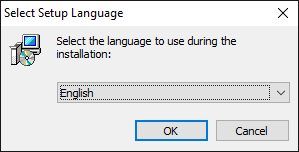
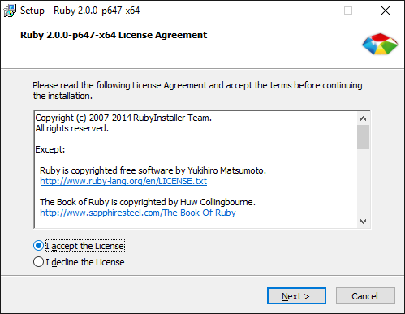
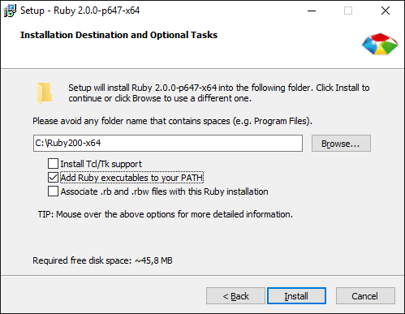
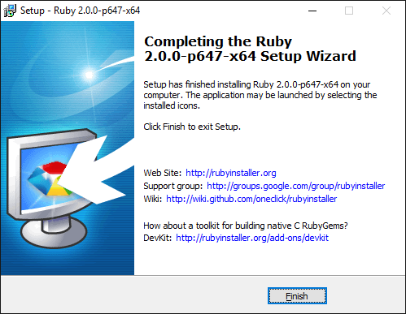
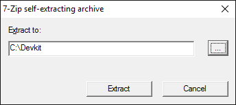
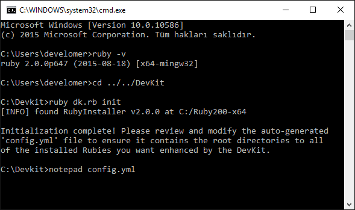
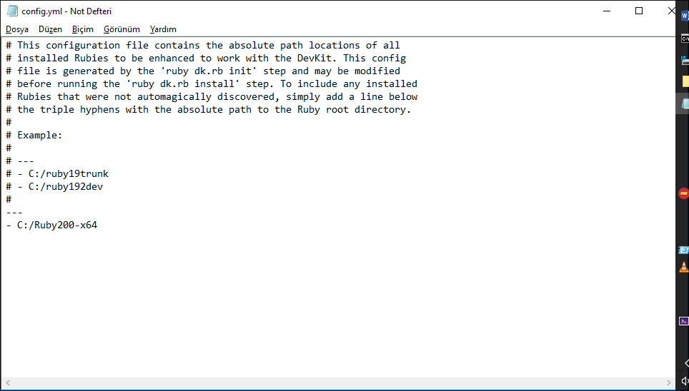
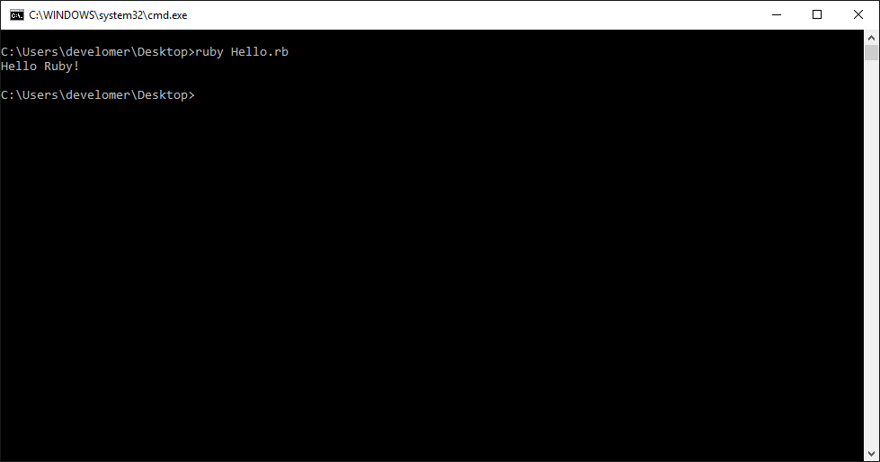

##Giriş

Merhaba,
Bugün biraz Ruby dilinden bahsedeceğim. Ruby 1995 yılında Yukihiro Matsumoto tarafından geliştirilmeye başlanmıştır. 
Sözdizimi olarak Python diline benzerlik gösterse de temelde Python’daki eksiklikler üzerine geliştirilmiş bir programlama dilidir. 
Birde nesneye yönelik programlama dili olduğunu belirtmeyi unutmayayım! Şimdi Ruby’i Windows makinemize nasıl kuruyoruz ona bakalım;


---

#####1 - Ruby Kurulumu

-	<http://rubyinstaller.org/downloads/> web sitesinden işletim sistemimize uygun bir versiyonu seçip indiriyoruz(*Benim kurduğum versiyon - 2.0.0 | x64 bit*).
-	Windows tabanlı rubyinstaller dosyası; ruby derleme/çalıştırma ortamı, gerekli temel gemleri(gem = kütüphane), 
bazı gerekli extensionları ve doc klasörü altında gayet yararlı olabilecek dokümanları bilgisayarımıza yükleme konusunda dostane bir kolaylık sağlamakta.
-	İndirdiğimiz dosyayı çalıştırıyoruz ve aşağıdaki adımları izliyoruz.



-	Japonca’mız olmadığı için **English** seçeneğini seçip devam ediyoruz :)



-	**I accept the Licence** seçeneğini seçerek devam ediyoruz.



-	Kurulum klasörünü **C:\Ruby200-64** olarak ayarlıyoruz ve **Add Ruby executables to your PATH** seçeneğini seçerek uygulamamızın ortam değişkenlerinde yol 
olarak eklenmesini istediğimizi belirtiyoruz. Seçimimizi yaptıktan sonra devam ediyoruz.




-	**Finish** butonuna tıklayarak kurulumumuzu tamamlıyoruz.

---

#####2 - Devkit Kurulumu

-	<http://rubyinstaller.org/downloads/>  sitesinden uygun devkit versiyonunu indiriyoruz(*Benim kurduğum versiyon - 4.7.2-20130224-1432 | x64 bit*).
-	DevKit; **RDiscount** ve **RedCloth**  gibi Standart **C/C++** tabanlı extensionları Windows üzerinde Ruby’de kullanmızı sağlayan bir araç takımıdır.




-	İndirdiğimiz dosyayı çalıştırıyoruz ve yolu **C:\Devkit** seçerek çıkarma işlemini başlatıyoruz.



-	Komut satırını açıyoruz ve **DevKit** klasörüne gidiyoruz
-	Burada ilk olarak **ruby dk.rb init** komutunu çalıştırıp dosyayı initialize işlemini yapıyoruz.
-	**notepad config.yml** komutunu çalıştırarak dosyayı açıp aşağıdaki ekran görüntüsündeki gibi **– C:/Ruby200-x64** satırının eklenip eklenmediğini kontrol ediyoruz. 
Eklenmemişse ekliyoruz ve dosyayı kaydedip, kapatıyoruz.




-	Son olarak sırasıyla **ruby dk.rb review** ve **ruby dk.rb install** komutlarını çalıştırıyoruz ve aşağıdaki ekran görüntüsünü elde ediyoruz.


---

#####3 - Hello Ruby!

Kurulumu bu şekilde tamamladık. Şimdi ekrana **“Hello Ruby!”** yazdırmazsak ayıp olur :) Herhangi bir yerde **Hello.rb** adlı bir dosya oluşturalım ve 
içine aşağıdaki kod parçasını yapıştıralım.

```ruby
puts 'Hello Ruby!'
```

İşte bu kadar. Şimdi yazdığımız kodu çalıştırmak için komut satırından dosyamızın olduğu yola gelelim, aşağıdaki ekran görüntüsündeki komutu çalıştıralım ve sonucu görelim.



Şimdilik bu kadar. İyi çalışmalar. Sağlıcakla...

##Referanslar:

1.<http://rubyinstaller.org/>  
2.<http://yizeng.me/>  
