##Giriş

Merhaba,
Bugün benimde nacizane sitemi hazırladığım jekyll uygulamasını Windows'ta kullanabilmek için ortamı nasıl hazırlayacağımızı anlatacağım. 
Ama bu kurulumlara başlamadan önce **Ruby** ve **DevKit** kurulumlarını yapmış olmanız gerekiyor. **<http://develomer.me/articles/RubyInstallation/>** adresindeki adımları izleyerek 
kurulumları yapabilirsiniz. Hadi bilmeyenler için biraz jekyll nedir ondan bahsedelim.

---

####Jekyll Nedir?
Jekyll statik site oluşturabileceğimiz, Ruby dilinde yazılmış bir uygulama. Belli bir dizin yapısı var ve bu yapıya bağlı kalarak sitemizi oluşturabiliyoruz. 
Örnek dizin yapısı aşağıdaki gibidir;

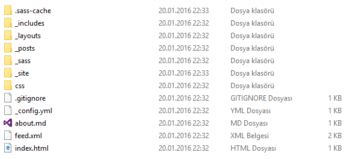

Tabii bu dizin yapısı projeye göre değişkenlik gösterebilir. Ekran görüntüsünde gördüğümüz dizin yapısı **jekyll new testblog** komutunu çalıştırarak
yeni bir jekyll projesi oluşturduktan sonra gördüğümüz ilk dizin yapısı. Bu konulara ve kullanıma daha sonra başka yazılarda değinmeye çalışacağım. Şimdilik
kuruluma geçelim.

---

#####1 - Jekyll Kurulumu

-	Şimdi komut satırını yönetici olarak açıyoruz ve **gem install jekyll** komutunu çalıştırıyoruz.
-	Aşağıdaki ekran görüntüsündeki gibi gemlerin kurulduğunu görüyoruz.

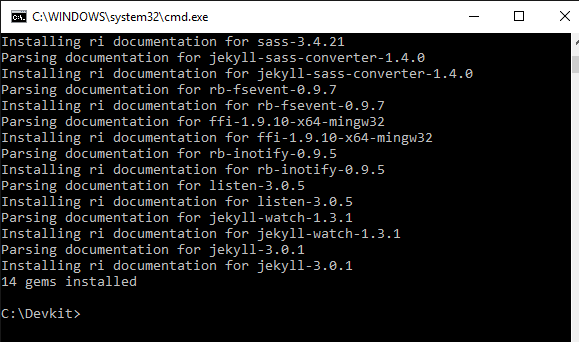

---

#####2 - Syntax Highlighter'ların Kurulumu

-	Syntax Highlighter’lar web sitemize eklediğimiz kodların renkli ve güzel bir şekilde görünmesini sağlarlar. 
Bunun için Rouge ya da pygments yükleyebiliriz. Fakat pygments desteklediği diller açısından daha avantajlı durumdadır. 
Bununla birlikte python ve pip kurulumunu zorunlu hale getiriyor.

######3.1 - Rouge Kurulumu

-	Gayet basit. **gem install rouge** komutunu çalıştırarak rouge gemini yüklüyoruz ve kullanıma hazır hale geliyor.
-	Projemizde _config.yml dosyasında *highlighter: rouge* satırını ekleyerek/düzenleyerek aktif hale getiriyoruz.

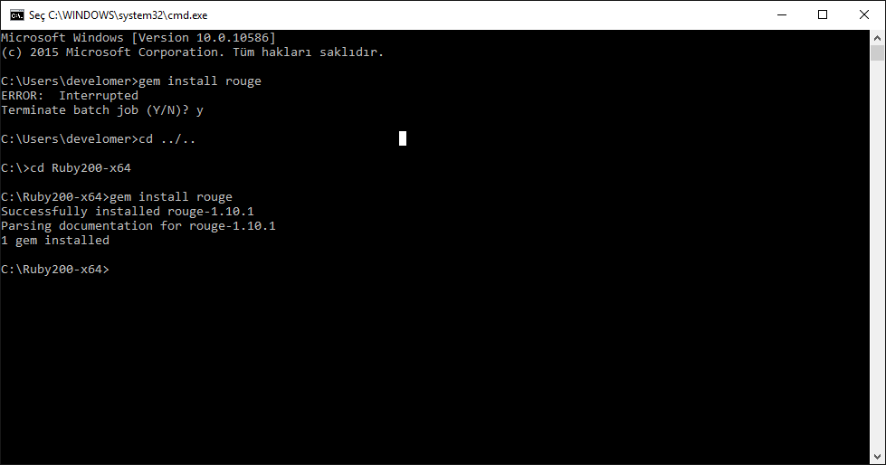

######3.2 - Pygments Kurulumu

***- Python Kurulumu***

-	<http://www.python.org/download/> web sitesinden python kurulumunu indirip çalıştırıyoruz(*Benim kurduğum versiyon - 2.7.8 | x64 bit*).

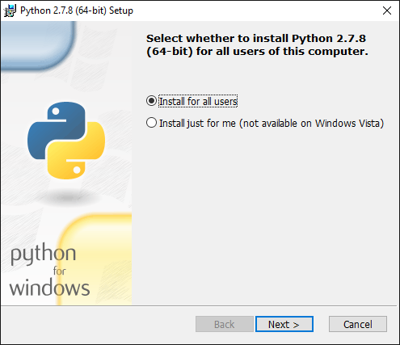

-	**Install for all users** seçeneğini seçip devam ediyoruz.

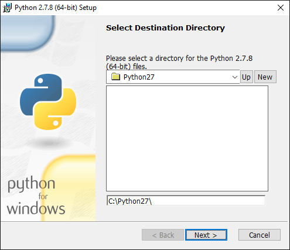

-	Yükleme yolunu **C:\Python27** olarak seçip devam ediyoruz.

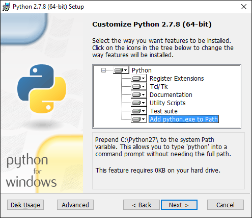

-	**Add python.exe to Path** seçeneğini aktif edip devam ediyoruz.

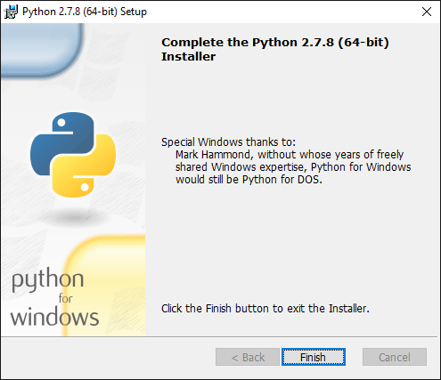

-	**Finish** butonuna tıklayıp yükleme işlemini tamamlıyoruz.

***- Pip Kurulumu***

-	C diski altında pip adında bir klasör oluşturuyoruz.
-	<https://bootstrap.pypa.io/get-pip.py> linkindeki yazıları kopyalayıp  oluşturduğumuz klasör altında **get-pip.py** adında dosya oluşturarak içine yapıştırıyoruz.
-	Komut satırında **C:\pip** yoluna geliyoruz.
-	Aşağıdaki ekran görüntüsündeki gibi **python get-pip.py** komutunu çalıştırıyoruz ve kurulumu yapıyoruz. 

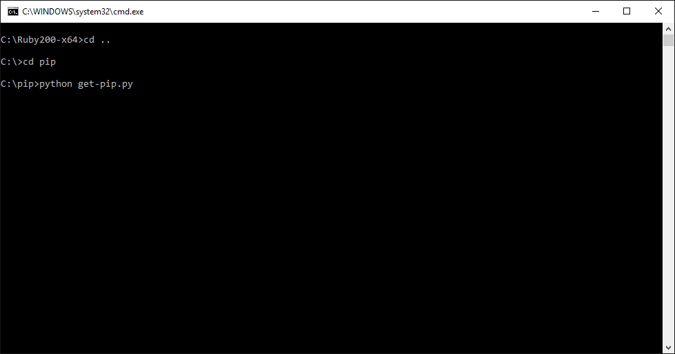

***- Pygments Kurulumu***

-	Aşağıdaki ekran görüntüsünde olduğu gibi **python -m pip install Pygments** komutunu çalıştırarak pygments’i kuruyoruz.

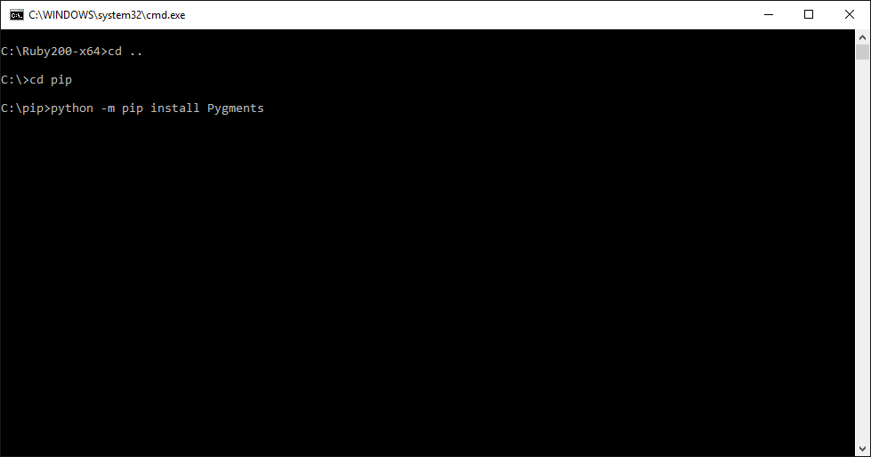

---

####4 - Jekyll Yeni Proje Oluşturma Ve Çalıştırma

-	**jekyll new testblog** komutunu çalıştırarak **testblog** adında yeni bir jekyll projesi oluşturuyoruz.

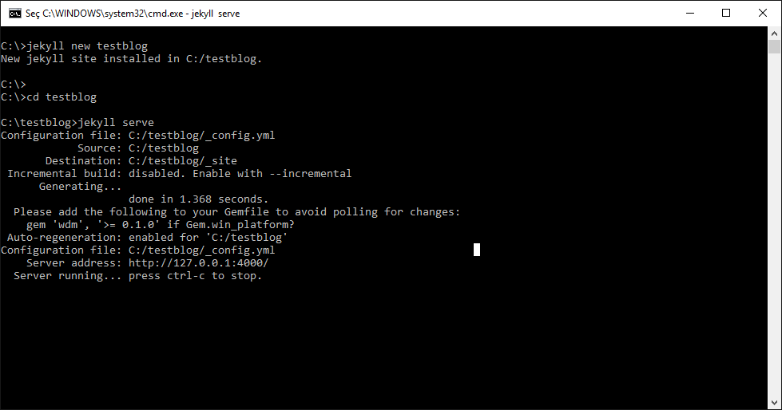

-	Oluşturduğumuz projenin içine giriyoruz ve **jekyll serve** komutunu çalıştırarak sunucuyu ayağa kaldırıyoruz. 
Ekranda gördüğümüz gibi http://127.0.0.1:4000/ linkine girerek projemizi görüntüleyebiliriz. İlk ekran görüntümüz aşağıdaki gibidir.

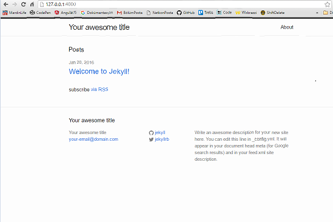

Şimdilik bu kadar. İyi çalışmalar. Sağlıcakla...

##Referanslar:

1.<http://jekyll-windows.juthilo.com/>  
2.<http://yizeng.me/>  
